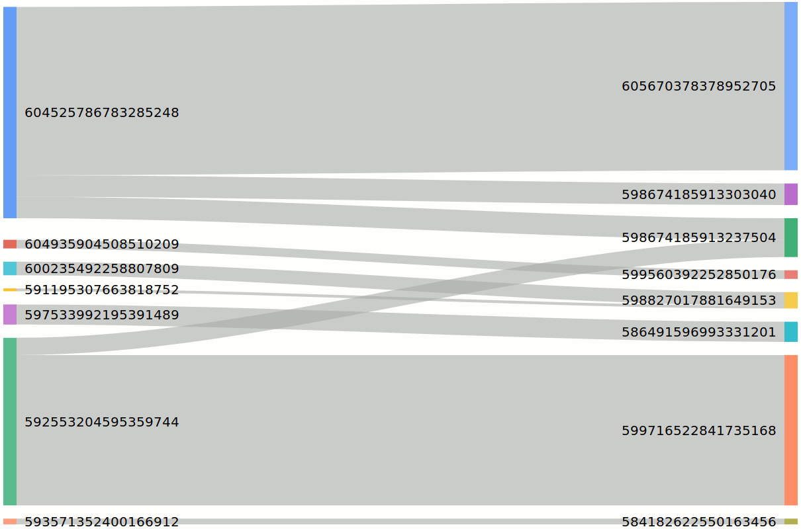

# LND forwarding history diagram

This little webservice visualizes [LNDs](https://github.com/lightningnetwork/lnd) forwarding history as sankey diagram. It show the incoming channels on the left side, the outgoing channels on the right side. The thickness is proportional to the forwarded amount of Satoshis.



## Run it locally

You need this software:

* nodejs (tested with v10.14.2)
* yarn (tested with 1.12.3)

```sh
yarn # install dependencies

# run it
yarn start \
  --lnd.macaroon readonly.macaroon \
  --lnd.rpccert lnd_rpc.crt \
  --lnd.rpcserver localhost:10009 \
  --port 4201

# use it
open http://localhost:4201
```

---
I appreciate tipps to [3EBGGBgkUyY29LoBgL7TtL7rGvv81HQp4h](bitcoin:3EBGGBgkUyY29LoBgL7TtL7rGvv81HQp4h) or via lightning to [tippin.me/@hpbock_tweet](https://tippin.me/@hpbock_tweet).